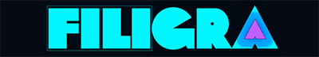

# FiLiGRA — Watermark & Transcode Studio

<div align="center">



**Studio vidéo 100% Client-Side WebAssembly (PWA) — Aucun serveur, confidentialité totale.**

[](https://ffmpegwasm.netlify.app/)
[](https://web.dev/progressive-web-apps/)
[](https://pages.github.com/)
[](https://instagram.com/t12lve)

</div>

---

## ⚡ Présentation

**FiLiGRA** est une Progressive Web App (PWA) de niveau professionnel permettant d'incruster interactivement des filigranes graphiques (logos, signatures, overlays) et de transcoder des vidéos directement dans votre navigateur web.

Conçu selon la philosophie **Zero-Backend**, l'intégralité du traitement vidéo (décodage, composition graphique Canvas 2D, réencodage matériel H.264 et compression audio AAC) est exécuté localement sur votre processeur via **WebAssembly (`FFmpeg.wasm`)**. 

Aucune vidéo, image ou donnée personnelle ne transite jamais par un serveur externe.

---

## ✨ Fonctionnalités Clés

### 🎨 Direction Artistique & UI Sombre Cyber
- **Design System Dédié** : Fond obsidienne cyber-abyssal (`#020710` - `#030a14`), reflets cyan électrique (`#00F5FF`) et accents magenta néon (`#BF5FFF`).
- **Cartes Bento Glassmorphism** : Rendu visuel épuré avec flou d'arrière-plan (`backdrop-filter: blur(24px)`) et contours ultra-fins de 1px.
- **Ergonomie Mobile Avancée** : Bottom navigation dock et tiroirs coulissants (*bottom sheets*) fluides pour smartphones iPhone et Android.
- **Menu Burger Latéral** : Accès rapide au guide d'utilisation, raccourcis et informations de version.

### 📐 Presets Unifiés & Ratios Réseaux Sociaux (SVG)
- **9:16 Vertical (1080×1920)** : Unifié pour **TikTok**, **YouTube Shorts** et **Instagram Reels**.
- **4:5 Portrait (1080×1350)** : Unifié pour **Instagram Feed** et **Twitter / X**.
- **1:1 Carré (1080×1080)** : Standard universel pour publications et carrousels.
- **16:9 Paysage** : Résolutions Original, 1080p Full HD, 720p HD et 480p SD.
- **Choix du Remplissage** : Mode *Crop* (plein écran centré sans bandes noires) ou *Pad* (Letterbox avec bandes noires).

### 🎯 Guides UI « Safe Zones » & Détection de Collision
- **Overlays Vectoriels Réalistes** : Simulation fidèle des boutons de navigation des interfaces mobiles (avatar, j'aime, commentaires, légende basse, en-têtes).
- **Détection d'Obstruction en Direct** : Si le filigrane chevauche un bouton de l'application cible, la boîte de sélection passe instantanément au rouge d'alerte (`#F43F5E`).
- **Action Rapide « Zone Sûre »** : Un bouton dédié repositionne instantanément le logo dans la zone 100% garantie sans conflit d'interface.
- **Guides Purement Indicatifs** : Les calques d'interfaces servent uniquement de repères visuels pendant l'édition et **ne sont pas gravés** dans la vidéo exportée (une option permet de les inclure si désiré).

### 🎛️ Éditeur WYSIWYG Tactile
- **Contrôle Direct Pointer Events** : Déplacement et redimensionnement intuitifs à la souris ou au doigt.
- **Auto-dimensionnement Intelligent** : Calibrage automatique de l'échelle du logo en fonction de la résolution de la vidéo.
- **Réglages Précis** : Curseurs d'échelle (5% à 80%), opacité (5% à 100%), rotation (0° à 360°) et 5 points d'ancrage rapide.

### ⚙️ Moteur d'Encodage FFmpeg.wasm & Estimation Prédictive
- **Calculateur de Poids Temps Réel** : Estimation du poids final en Mo selon la formule logarithmique x264 CRF.
- **Profil d'Encodage Safari / WebKit** : Format de pixels `yuv420p` et `faststart` garantissant une lecture immédiate sur tous les navigateurs mobiles et desktop.
- **Isolation Cross-Origin Automatique** : Intégration de `coi-serviceworker.js` pour activer `SharedArrayBuffer` sans configuration serveur complexe.

---

## 🚀 Démarrage Rapide

### 1. Clonage du Répertoire
```bash
git clone https://github.com/t12lve/FiLiGRA.git
cd FiLiGRA
```

### 2. Lancement Local
FiLiGRA nécessite un serveur HTTP local pour servir les modules WebAssembly et les Service Workers.

#### Avec Python :
```bash
python -m http.server 8000
```
Ouvrez ensuite `http://localhost:8000` dans votre navigateur (Chrome, Firefox, Safari ou Edge).

#### Avec Node.js :
```bash
npx serve .
```

---

## 🌐 Déploiement sur GitHub Pages

1. Rendez-vous dans les **Settings** de votre dépôt GitHub.
2. Allez dans l'onglet **Pages** (dans le menu de gauche).
3. Sous **Source**, sélectionnez la branche `main` (ou `master`) et le dossier `/ (root)`.
4. Cliquez sur **Save**.

> **Note Technique :** L'activation du multi-threading WebAssembly (`SharedArrayBuffer`) sur GitHub Pages est gérée automatiquement par [`coi-serviceworker.js`](coi-serviceworker.js), qui intercepte les requêtes pour injecter les en-têtes de sécurité requis :
> - `Cross-Origin-Opener-Policy: same-origin`
> - `Cross-Origin-Embedder-Policy: require-corp`

---

## 🛠️ Stack Technologique

- **Langages** : HTML5 sémantique, CSS3 moderne (Variables HSL/Hex, Glassmorphism, Responsive Grid), JavaScript Vanilla (ESNext).
- **Moteur Graphique** : HTML5 Canvas 2D interactif avec Pointer Events API.
- **Moteur Vidéo** : `@ffmpeg/ffmpeg` v0.12 et `@ffmpeg/core` compilé en WebAssembly.
- **PWA** : Service Worker, Web App Manifest (`manifest.json`), Offline Ready.

---

## 👤 Auteur & Crédits

Vibecodé avec passion en Septembre 2026 par **T12lve**.

- **Instagram** : [@t12lve](https://instagram.com/t12lve)
- **Licence** : MIT — Libre d'utilisation personnelle et commerciale.
